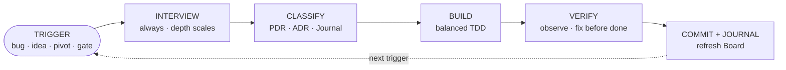

<div align="center">

# Methodology Kit

**Build a project with an AI agent as the main builder — and keep its docs, decisions, and state from drifting out of sync.**

[Quickstart](00-START-HERE.md) · [Handbook](handbook/) · [Reference](reference/)

[](LICENSE)
&nbsp;[](https://claude.com/claude-code)
&nbsp;
&nbsp;

</div>

A **method** — how you decide, work, and keep the project in order — plus the **assets** that enforce it: living documentation, skills, git hooks, sentinels, CI. Built for Claude Code but tied to no stack and no application domain: copy it into a project and adapt it.

## Who it's for

For a project where **one person directs** (decides what to do, reviews the work, sets the direction) and **the AI agent writes the code**. This person is a *PM-director*: they can be a product manager who doesn't program, or a developer — in both cases, in AI-assisted work, their craft is directing and deciding, not typing. The only practical difference is whether the "plain language" communication layer is needed or not.

## What it rests on

Two ideas, from which everything else follows:

1. **Binding automation over voluntary discipline.** The number-one risk of living documentation is that the files diverge from each other: the board says one thing, the code another, the notes a third. A note saying "remember to…" is not enough, because no one enforces it; a hook that **blocks the commit** if the thing isn't done, yes. So the method prefers hooks, linters and sentinels over write-only rules.
2. **The level of the record depends on how LONG a decision lasts, not on how much code it produces.** A product pivot → a direction record; an architecture decision → an ADR; everything else → a diary line. Three lines of code can be worth an ADR; a thousand reversible lines, a diary line.

## The core loop

Every piece of work — a bug, an idea, a polish, a pivot — goes through the same deterministic flow. The depth scales with the work; the steps are never skipped. (Full detail in [`handbook/01-operating-model.md`](handbook/01-operating-model.md).)



## How it's organized

Three layer-folders, plus two guide-files at the top:

- **`handbook/`** — *the why*: the method explained, one chapter per theme. Read it to understand how it works (the new project's agent reads it too, not just the human).
- **`scaffold/`** — *the real files to copy* into the project: the `CLAUDE.md` charter, the documentation, the hooks, the skills, the CI. They contain `{{...}}` placeholders to fill.
- **`reference/`** — *pattern catalogs* to consult when you need the detail (not to copy verbatim).
- **`README.md`** (this) and **`00-START-HERE.md`** — the step-by-step bootstrap guide, with the list and spec of every file.

```
methodology-kit/
├── README.md            ← (this) what it is, how it's built, how to use it
├── 00-START-HERE.md     ← step-by-step bootstrap guide + list/spec of every file
│
├── handbook/            ← THE WHY — the method explained (narrative, [agnostic])
│   ├── 00-philosophy.md           ← the two load-bearing ideas; direction separated from technical
│   ├── 01-operating-model.md      ← the Intervention (trigger→interview→build→commit) + the Gates
│   ├── 02-decision-discipline.md  ← ADR / mini-ADR / direction record, dual register
│   ├── 03-ssot-architecture.md    ← which file is the source-of-truth for what, reading order
│   ├── 04-living-state-machine.md ← Board + Journal + ledger, sentinels, anti-drift audit
│   ├── 05-communication.md        ← double layer technical + "plain language", interview style
│   ├── 06-engineering-practices.md ← balanced TDD, recon, validate-the-source, git discipline
│   ├── 07-claude-harness.md       ← CLAUDE.md, memory, skills, commands, settings, workflow
│   ├── 08-quality-automation.md   ← hooks, CI, linter, gitleaks + sops, guards-are-tested
│   └── 09-operating-profiles.md   ← solo/team profiles: the topology that modulates git, CI, state, authority
│
├── scaffold/            ← THE REAL FILES TO COPY (fill the {{PLACEHOLDER}}s; each tagged [agnostic]/[Node-ref])
│   ├── CLAUDE.md · README.md · ONBOARDING.md · COMMON-COMMANDS.md
│   ├── .claude/ (settings, skills, handoff command, example workflow)
│   ├── biome.json · turbo.json · package.json.snippet · .gitignore · .gitleaks.toml · .sops.yaml.example · .mcp.json.example
│   ├── scripts/ (sentinels, generators, tested guard, secrets loader)
│   ├── .github/ (CI workflow — used in the team profile)
│   ├── docs/ (direction, identity, architecture + ADR, implementation: Board/Journal/discipline)
│   └── docs-site/ (Starlight: renders docs/ as a site, automatic rebuild)
│
└── reference/           ← PATTERN CATALOGS ([agnostic], to consult, not to copy verbatim)
    ├── pattern-nested-claude-md.md   ← the per-folder CLAUDE.md forms + anti-patterns
    ├── memory-protocol.md            ← spec of the agent's memory system
    ├── context-engineering.md        ← context rot → fresh-context subagents
    ├── pattern-ci.md                 ← the 3 CI archetypes
    ├── sentinels-and-generators.md   ← guard/generator catalog + severity
    └── audit-drift-template.md       ← the periodic anti-drift audit ritual
```

### Two labels on the files

- **`[agnostic]`** — applies in any language/stack: copy it as-is and replace the placeholders.
- **`[Node-ref]`** — reference implementation in Node. If your project is Node it's drop-in; otherwise read *what it does* (described in the banner at the top of the file) and rewrite it in your stack.

> [!IMPORTANT]
> **Not everything carries the same weight.** Some choices are *invariants* — remove them and the method stops working (anti-drift automation, record-by-duration, interview-before-build, living state machine, secrets twin). Others are *swappable defaults* — preferences with a rationale (`main` vs branch/PR, the lint tool, monorepo yes/no, etc.). When the kit seems to contradict a choice of yours, you're almost always looking at a swappable default, not a conflict. The full distinction is in [`00-START-HERE.md`](00-START-HERE.md).
>
> Adopt the invariants **as fully as you can** — the value is emergent, so partial adoption gives partial benefit. Keep your own *tools* where they work; don't leave a *gap* in the invariants just because change is friction. The keep/replace/graft call, area by area, is led by your project's own agent — it has the context.

## How to use it

1. Read **`00-START-HERE.md`** — the step-by-step bootstrap and the spec of every file.
2. Have the agent read the **`handbook/`**, so it internalizes the method.
3. Copy the **`scaffold/`** into the project, fill the `{{...}}` placeholders, activate the hooks.
4. Keep the **`reference/`** at hand for the details of a pattern.

> [!NOTE]
> **Conventions.** Everything is in English. The examples are neutral (labeled "Example", no brand) and the project-specific values are `{{...}}` placeholders to replace — the full list is in `00-START-HERE.md`. Nothing in the kit is tied to a particular application domain.
